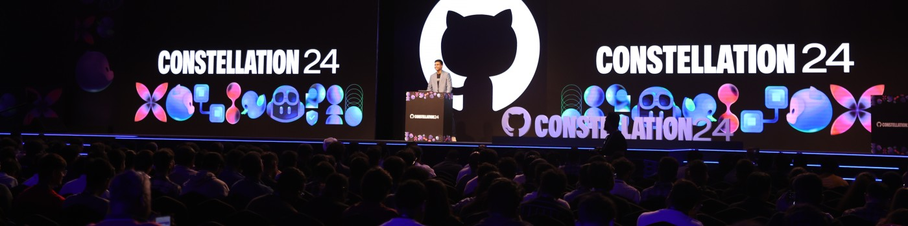

# Hi 👋 I'm Yashraj!

Developer and People Person.

## About Me

Program Manager at GitHub Developer Relations, where I help spark creativity and excitement around GitHub while finding new ways to connect with developers worldwide.

My community journey began as a Microsoft Student Partner during university, where I proudly represented India at a worldwide summit at Microsoft HQ. Over the years, I've built and scaled developer communities that have reached hundreds of thousands of tech enthusiasts.



## Professional Experience

**GitHub** | Program Manager, Developer Relations (Mar 2024 - Present)
- Leading planning and execution of Constellation 2024, GitHub's developer conference in India
- Growing key programs like the Global Meetups Program and premier events (GitHub Universe Recap, GitHub Connect India)
- Scaling the GitTogethers program across India with monthly developer meetups in major cities
- Representing developer voices internally to improve the GitHub ecosystem

**ANSR** | Senior Community Manager (Mar 2023 - Feb 2024)
- Built community programs from scratch, reaching 6,000+ active developers in 8 months
- Hosted 20 successful tech events with 3,000+ attendees (ReactJS Meetups, Women in Tech events)
- Advocated for community needs within the GCC ecosystem

**OutSystems** | APAC Community Growth Manager (Mar 2021 - Feb 2023)
- Expanded global community programs throughout Asia-Pacific
- Led initiatives like #14DaysOfOutSystems Challenge and OutSystems Student Accelerator
- Supported user group organizers across APAC to build strong local communities

**Progate** | India Community Manager (Jun 2018 - Feb 2021)
- Managed India community of 200,000+ learners at this Japanese coding platform
- Established Community Partnership with Hacktoberfest 2020
- Organized 30+ Learning Jams across major Indian cities
- Reached 6,000+ high school students through Hour of Code™ 2018 Campaign

## Skills & Technologies

```javascript
const skills = {
  developerRelations: ['Program Management', 'Developer Engagement', 'Developer Advocacy'],
  technical: ['JavaScript', 'React', 'Microsoft Azure', 'GitHub Actions', 'Low-Code Development'],
  languages: ['English', 'Hindi']
};
```


## Connect With Me

[![Twitter][1.1]][1.2]

[1.1]: https://img.shields.io/badge/Twitter-1DA1F2?style=for-the-badge&logo=twitter&logoColor=white
[1.2]: https://twitter.com/yashrajnayak

[![LinkedIn][2.1]][2.2]

[2.1]: https://img.shields.io/badge/LinkedIn-0077B5?style=for-the-badge&logo=linkedin&logoColor=white
[2.2]: https://www.linkedin.com/in/yashrajnayak
