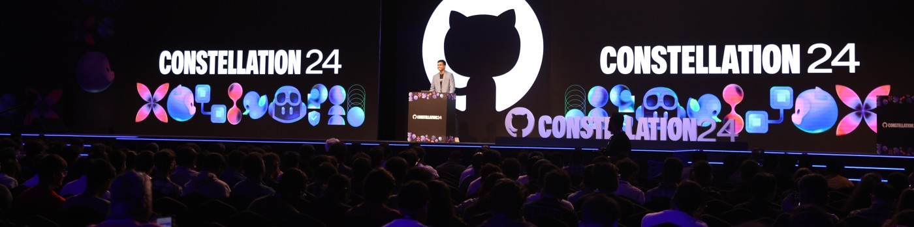

# Hi, I'm Yashraj Nayak

Program Manager, Developer Relations at Databricks. I work at the intersection of developer communities, data and AI education, university programs, and practical tooling that helps teams run better developer experiences.

<div align="left">

[](https://yashrajnayak.com)
[](https://www.linkedin.com/in/yashrajnayak/)
[](https://x.com/yashrajnayak)
[](https://instagram.com/yashrajnayak.dev)

</div>

## About

- I lead University Alliances and Student Programs for Databricks in India, helping build a stronger pipeline of data and AI talent across institutions.
- I have 9+ years of experience building and scaling developer communities across India and APAC.
- Previously, I supported MongoDB User Groups globally, contributed to GitHub Developer Relations programs in India, grew OutSystems' APAC community, and helped Progate reach 200,000+ learners in India.
- I enjoy turning repeatable community operations into lightweight tools, automations, playbooks, and products.
- Based in Bangalore, India.

## What I Work With

```javascript
const yashraj = {
  currentFocus: ['Databricks', 'University Alliances', 'Student Programs', 'Data + AI education'],
  devRel: ['Program Management', 'Developer Engagement', 'Community Building', 'Technical Events'],
  technical: ['JavaScript', 'React', 'C#', 'GitHub Actions', 'Microsoft Azure'],
  languages: ['English', 'Hindi']
};
```

## Current Builds

| Project | What it does | Stack |
| --- | --- | --- |
| [Luma Bulk Check-In](https://github.com/yashrajnayak/luma-bulk-checkin) | Chrome extension for operator-assisted bulk check-in on Luma event pages. | JavaScript, Chrome Extensions |
| [Codex Fli Flight Search Skill](https://github.com/yashrajnayak/codex-fli-flight-search-skill) | Codex skill for searching and comparing Google Flights results with `fli`. | Python, Codex Skills |
| [TalkForge](https://github.com/yashrajnayak/talkforge) | AI-powered conference talk and workshop topic generator from LinkedIn profiles. | JavaScript, Gemini, PDF.js |
| [List Minus](https://github.com/yashrajnayak/list-minus) | Minimal static tool for subtracting one line-based list from another. | HTML, CSS, JavaScript |
| [Developer Portfolio](https://github.com/yashrajnayak/developer-portfolio) | Configurable developer portfolio designed for GitHub Pages. | JavaScript, GitHub Pages |

## Selected DevRel Work

- **GitHub Constellation 2024** - supported GitHub's Bengaluru developer conference with 20+ speakers and 900+ in-person attendees.
- **GitTogether Meetups Automation System** - built a GitHub Actions pipeline for multi-repository event operations, issue creation, assignment, and lifecycle tracking.
- **GitTogethers Registration Web Platform** - built a responsive event registration and check-in platform with GitHub API integration.
- **MongoDB User Groups** - supported 40 existing user groups globally and helped launch or revive chapters in Seoul, Abu Dhabi, Rio de Janeiro, and Cape Town.

## Certifications

- [GitHub Foundations](https://www.credly.com/badges/7754da79-07d9-4abe-9f9e-e0c9a84a34b4/)
- [GitHub Copilot](https://www.credly.com/badges/370d77b0-13a0-45a7-92ae-3326f64786be/)
- [Microsoft Applied Skills: Accelerate App Development by using GitHub Copilot](https://learn.microsoft.com/api/credentials/share/en-in/yashrajnayak/962FF988EFFAE330?sharingId=7AC6735FC0CD4144)
- [Meta Certified Community Manager](https://www.credly.com/badges/9f1fd9c1-3469-47d0-ad43-2647f638d622/)

## GitHub Stats

<div align="left">


</div>
