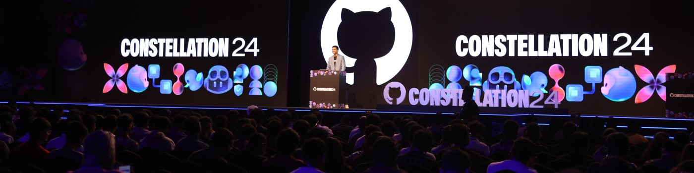

<!-- Generated from the website config.json. Do not edit by hand. -->

# Yashraj Nayak

Student Programs (APJ) at Databricks. Co-founder, Bengaluru Tech Week. Codex Ambassador.

I bring developers together to learn, build and share what works.

[Explore my personal website](https://yashrajnayak.com/) · [Download profile (PDF)](https://yashrajnayak.com/assets/downloads/yashraj-nayak-profile.pdf)

[GitHub](https://github.com/yashrajnayak) · [LinkedIn](https://www.linkedin.com/in/yashrajnayak/) · [X](https://x.com/yashrajnayak)

## About

I work where developer education, community programs and software meet. I help people get started, meet fellow builders and keep learning.

## Current work

### [Bengaluru Tech Week](https://bengalurutechweek.com/about)

A citywide week of independently hosted events. Working with a community of hosts, I helped bring different corners of Bengaluru’s tech ecosystem into one shared program.

### [Learning by building.](https://bharatbricks.org/)

Connecting students with the possibilities of data and AI.

I work on student programs across APJ at Databricks. Earlier this year, I helped build and run Bharat Bricks Hacks across five campuses in India.

What stays with me is the process: a rough idea, a team working through the hard parts, and a prototype they can finally show.

### [Make something. Learn together.](https://www.linkedin.com/feed/update/urn:li:activity:7510543162411634689/)

Hosting Codex meetups and hackathons in Bengaluru, sharing what I learn, and meeting the wider builder community. This year’s journey also took me to OpenAI Dev Day in San Francisco.

## Projects

- **[Developer Portfolio](https://github.com/yashrajnayak/developer-portfolio)** — A configurable starting point for a personal website.
- **[Connecticut](https://github.com/yashrajnayak/connecticut)** — Explore the connections between people on GitHub.
- **[GitTogethers](https://gittogethers.github.io/)** — Registration and check-in for developer gatherings.

## Certifications

- [GitHub Foundations](https://www.credly.com/badges/7754da79-07d9-4abe-9f9e-e0c9a84a34b4/)
- [GitHub Copilot](https://www.credly.com/badges/370d77b0-13a0-45a7-92ae-3326f64786be/)
- [Microsoft Applied Skills: Accelerate App Development by using GitHub Copilot](https://learn.microsoft.com/api/credentials/share/en-in/yashrajnayak/962FF988EFFAE330?sharingId=7AC6735FC0CD4144)
- [Meta Certified Community Manager](https://www.credly.com/badges/9f1fd9c1-3469-47d0-ad43-2647f638d622/)
